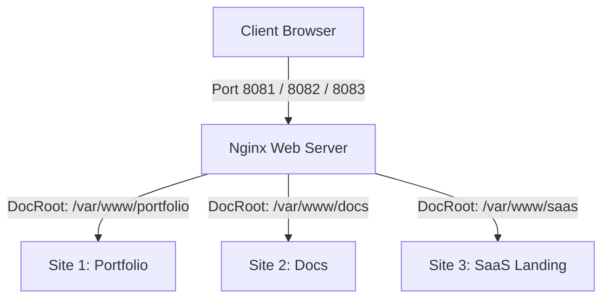
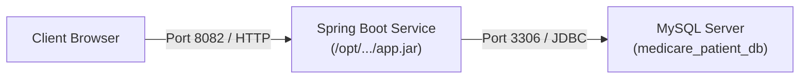

# CẨM NANG TOÀN DIỆN ÔN THI DEVOPS: TRIỂN KHAI ỨNG DỤNG LÊN CLOUD VPS TỪ A ĐẾN Z

> **Dành cho sinh viên ôn thi môn DevOps / DevOps Fundamentals**  
> *Tác giả: Senior DevOps Lead & Architect*  
> *Mục tiêu:* Hướng dẫn độc lập, chi tiết từng câu lệnh để tự tay cấu hình và triển khai thành công cả 2 dạng bài thi kinh điển: **Web tĩnh (Nginx Multi-sites)** và **Web động (Spring Boot kết nối MySQL Database)**.

---

## MỤC LỤC
1. [Tư duy Cốt lõi & Chuẩn bị Môi trường](#1-tư-duy-cốt-lõi--chuẩn-bị-môi-trường)
2. [CHUYÊN ĐỀ 1: Triển khai Đa Website Tĩnh (HTML/CSS/JS) với Nginx](#2-chuyên-đề-1-triển-khai-đa-website-tĩnh-htmlcssjs-với-nginx)
3. [CHUYÊN ĐỀ 2: Triển khai Backend Spring Boot 3 kết nối MySQL Database](#3-chuyên-đề-2-triển-khai-backend-spring-boot-3-kết-nối-mysql-database)
4. [Kỹ thuật "Cách A": Quản lý Bật / Tắt Site khi thi Nhiều Câu](#4-kỹ-thuật-cách-a-quản-lý-bật--tắt-site-khi-thi-nhiều-câu)
5. [Checklist 5 Phút Cuối Giờ Trước Khi Tắt Máy Đi Về](#5-checklist-5-phút-cuối-giờ-trước-khi-tắt-máy-đi-về)

---

## 1. TƯ DUY CỐT LÕI & CHUẨN BỊ MÔI TRƯỜNG

### 1.1. Bản chất: Máy cá nhân (Local) vs Máy chủ (VPS Cloud)
- **Máy cá nhân (Laptop của bạn):** Chỉ là "Chiếc điều khiển từ xa" kết nối qua SSH. Khi bạn tắt máy, gập màn hình hoặc đi về, máy chủ VPS vẫn hoạt động độc lập 24/7 tại Data Center.
- **Tiến trình chạy ngầm (Daemon / Systemd):** Trong môi trường sản xuất (Production), không bao giờ được chạy ứng dụng bằng cách gõ lệnh trực tiếp trên terminal rồi để đó. Phải giao cho `systemd` quản lý để dịch vụ tự chạy nền và tự sống sót kể cả khi mất kết nối mạng.

### 1.2. Mẹo thực chiến số 1: Cấu hình SSH Alias trên Windows
Để trong phòng thi không phải nhớ IP dài dòng hay cổng SSH đặc thù (`2222`), hãy tạo file cấu hình SSH trên máy Windows:

Mở PowerShell:
```powershell
notepad $HOME\.ssh\config
```
*(Lưu ý: Tên file là `config`, tuyệt đối không để đuôi `.txt`)*.

Dán nội dung sau vào và lưu lại:
```text
Host vps
    HostName 103.72.57.112
    User devops
    Port 2222
    IdentityFile ~/.ssh/id_ed25519
```
> **Từ bước này trở đi:**
> - Muốn SSH vào VPS: Chỉ cần gõ `ssh vps`
> - Muốn copy file lên VPS: Chỉ cần gõ `scp <tên_file> vps:~`

---

## 2. CHUYÊN ĐỀ 1: TRIỂN KHAI ĐA WEBSITE TĨNH (HTML/CSS/JS) VỚI NGINX

### 2.1. Sơ đồ kiến trúc Nginx


### 2.2. Bảng lệnh tóm tắt (Quy trình 6 bước chuẩn)
| Bước | Thực hiện tại | Lệnh then chốt | Ý nghĩa |
| :---: | :---: | :--- | :--- |
| **1** | **Local PC** | `scp -r projects vps:~` | Đẩy thư mục mã nguồn lên thư mục home của VPS |
| **2** | **VPS** | `sudo cp -r ~/projects/<site>/* /var/www/<site>/` | Đưa code vào thư mục web chuẩn của Linux |
| **3** | **VPS** | `sudo chown -R $USER:www-data /var/www/...`<br>`sudo chmod -R 755 /var/www/...` | **Chống lỗi 403 Forbidden** (Cấp quyền đọc cho Nginx) |
| **4** | **VPS** | `sudo nano /etc/nginx/sites-available/multi-sites.conf` | Viết file cấu hình Virtual Hosts (Server Blocks) |
| **5** | **VPS** | `sudo ln -s ... /etc/nginx/sites-enabled/`<br>`sudo nginx -t && sudo systemctl reload nginx` | Kích hoạt cấu hình và nạp lại Nginx |
| **6** | **VPS** | `sudo ufw allow 8081/tcp 8082/tcp 8083/tcp`<br>`curl -I http://localhost:8081` | Mở tường lửa và kiểm tra nghiệm thu |

---

### 2.3. Hướng dẫn chi tiết từng bước

#### BƯỚC 1: Đẩy mã nguồn từ máy lên VPS (Tại PowerShell)
Đứng tại thư mục chứa source code trên máy tính của bạn:
```powershell
scp -r projects vps:~
```
*(Sau khi copy xong, gõ `ssh vps` để vào màn hình điều khiển máy chủ).*

#### BƯỚC 2: Bố trí thư mục web trên VPS
```bash
# Tạo các thư mục đích trong /var/www/
sudo mkdir -p /var/www/portfolio /var/www/docs /var/www/saas-landing

# Copy toàn bộ code tương ứng vào từng thư mục
sudo cp -r ~/projects/portfolio/* /var/www/portfolio/
sudo cp -r ~/projects/docs/* /var/www/docs/
sudo cp -r ~/projects/saas-landing/* /var/www/saas-landing/
```

#### BƯỚC 3: Phân quyền Linux (Tuyệt đối không bỏ qua)
Nginx chạy dưới user hệ thống `www-data`. Nếu không cấp quyền, Nginx sẽ chặn truy cập (lỗi `403 Forbidden`):
```bash
# 1. Gán quyền sở hữu cho user hiện tại và nhóm www-data
sudo chown -R $USER:www-data /var/www/portfolio /var/www/docs /var/www/saas-landing

# 2. Cấp quyền 755 (Đọc và thực thi)
sudo chmod -R 755 /var/www/portfolio /var/www/docs /var/www/saas-landing
```

#### BƯỚC 4: Tự tay viết file cấu hình Nginx Server Block
Tạo file cấu hình trong thư mục `sites-available`:
```bash
sudo nano /etc/nginx/sites-available/multi-sites.conf
```
*Dán nội dung mẫu (chỉ cần nhớ 4 chỉ thị: `listen`, `server_name`, `root`, `index`):*
```nginx
# Site 1: Portfolio (Port 8081)
server {
    listen 8081;
    server_name _;
    root /var/www/portfolio;
    index index.html index.htm;
    location / {
        try_files $uri $uri/ =404;
    }
}

# Site 2: Docs (Port 8082)
server {
    listen 8082;
    server_name _;
    root /var/www/docs;
    index index.html index.htm;
    location / {
        try_files $uri $uri/ =404;
    }
}

# Site 3: SaaS Landing (Port 8083)
server {
    listen 8083;
    server_name _;
    root /var/www/saas-landing;
    index index.html index.htm;
    location / {
        try_files $uri $uri/ =404;
    }
}
```
*(Lưu file: `Ctrl + O` -> `Enter`. Thoát: `Ctrl + X`)*.

#### BƯỚC 5: Kích hoạt Virtual Host & Reload Nginx
```bash
# 1. Tạo Symbolic link sang sites-enabled
sudo ln -s /etc/nginx/sites-available/multi-sites.conf /etc/nginx/sites-enabled/

# 2. Kiểm tra cú pháp (Phải thấy "syntax is ok")
sudo nginx -t

# 3. Reload nạp cấu hình mới
sudo systemctl reload nginx
```

#### BƯỚC 6: Mở tường lửa UFW & Nghiệm thu
```bash
# 1. Mở các cổng trên UFW
sudo ufw allow 8081/tcp
sudo ufw allow 8082/tcp
sudo ufw allow 8083/tcp

# 2. Kiểm tra bằng curl nội bộ
curl -I http://localhost:8081
curl -I http://localhost:8082
curl -I http://localhost:8083

# 3. Mở trình duyệt máy tính kiểm tra:
# http://103.72.57.112:8081
# http://103.72.57.112:8082
# http://103.72.57.112:8083
```

---

## 3. CHUYÊN ĐỀ 2: TRIỂN KHAI BACKEND SPRING BOOT 3 KẾT NỐI MYSQL DATABASE

### 3.1. Sơ đồ kiến trúc 3 Lớp (3-Tier)


---

### 3.2. Bảng lệnh tóm tắt
| Bước | Thực hiện tại | Lệnh then chốt | Ý nghĩa |
| :---: | :---: | :--- | :--- |
| **1** | **VPS** | `sudo apt install mysql-server`<br>`sudo mysql` | Cài đặt và tạo database, user, password |
| **2** | **VPS** | `sudo apt install openjdk-21-jre-headless` | Cài môi trường Java runtime đúng phiên bản dự án |
| **3** | **Local / VPS** | `.\gradlew.bat bootJar -x test`<br>`scp ... vps:~/app.jar` | Đóng gói mã nguồn thành file JAR và đẩy lên VPS |
| **4** | **VPS** | `sudo nano /etc/systemd/system/<tên>.service`<br>`sudo systemctl enable --now <tên>` | Chạy ứng dụng ngầm tự động với Systemd |
| **5** | **VPS** | `sudo ufw allow 8082/tcp` | Mở cổng tường lửa cho ứng dụng |
| **6** | **VPS / Local** | `curl http://localhost:8082/api/...`<br>`mysql -u root -p -e "SELECT ..."` | Nghiệm thu toàn diện từ API đến dữ liệu trong DB |

---

### 3.3. Hướng dẫn chi tiết từng bước

#### BƯỚC 1: Cài đặt và Thiết lập MySQL Database (Trên VPS)
```bash
# 1. Cài đặt MySQL
sudo apt update && sudo apt install -y mysql-server
sudo systemctl enable --now mysql

# 2. Đăng nhập vào MySQL console
sudo mysql
```

Dán 4 câu lệnh SQL sau vào terminal `mysql>`:
```sql
-- 1. Tạo Database
CREATE DATABASE IF NOT EXISTS medicare_patient_db CHARACTER SET utf8mb4 COLLATE utf8mb4_unicode_ci;

-- 2. Đặt mật khẩu cho root đúng theo application.yaml
ALTER USER 'root'@'localhost' IDENTIFIED WITH mysql_native_password BY '002203Huylam!';

-- 3. Cấp toàn quyền và thoát
GRANT ALL PRIVILEGES ON medicare_patient_db.* TO 'root'@'localhost';
FLUSH PRIVILEGES;
EXIT;
```

Kiểm tra kết nối của MySQL:
```bash
mysql -u root -p'002203Huylam!' -e "SHOW DATABASES;"
```
*(Hiển thị database `medicare_patient_db` là hoàn tất)*.

---

#### BƯỚC 2: Cài đặt Java Runtime trên VPS
Kiểm tra xem dự án yêu cầu Java mấy (Java 17 hay Java 21 trong `pom.xml` hoặc `build.gradle`):
```bash
# Cài đặt OpenJDK 21 Runtime (headless là bản tối ưu cho server, không có giao diện đồ họa)
sudo apt install -y openjdk-21-jre-headless

# Kiểm tra phiên bản
java -version
```

---

#### BƯỚC 3: Đóng gói và Đẩy file JAR lên VPS

##### 3.1. Lưu ý quan trọng trong file `application.yaml`:
- **Quy tắc 1:** `server.port` phải nằm ở cấp **ngoài cùng (root-level)**, không được lùi dòng nằm trong `spring:`.
- **Quy tắc 2:** Tắt Eureka và Config Server nếu chạy độc lập:
  ```yaml
  server:
    port: 8082

  spring:
    application:
      name: medicare-medical-service
    cloud:
      config:
        enabled: false
    datasource:
      url: jdbc:mysql://localhost:3306/medicare_patient_db?createDatabaseIfNotExist=true&useSSL=false&allowPublicKeyRetrieval=true&serverTimezone=UTC
      username: root
      password: 002203Huylam!
      driver-class-name: com.mysql.cj.jdbc.Driver
    jpa:
      hibernate:
        ddl-auto: update
      show-sql: true

  eureka:
    client:
      enabled: false
  ```

##### 3.2. Build và SCP file JAR (Tại PowerShell máy cá nhân):
```powershell
# Nếu dùng Gradle:
.\gradlew.bat bootJar -x test

# Nếu dùng Maven:
# mvn clean package -DskipTests

# Đẩy file JAR lên thư mục Home của VPS (Đổi tên thành app.jar cho gọn):
scp build/libs/medicare-medical-service-0.0.1-SNAPSHOT.jar vps:~/app.jar
```

##### 3.3. Đưa file JAR vào thư mục chuẩn `/opt/` (Trên VPS):
```bash
sudo mkdir -p /opt/medicare-service
sudo mv ~/app.jar /opt/medicare-service/app.jar
sudo chown -R devops:devops /opt/medicare-service
```

---

#### BƯỚC 4: Tạo Systemd Service Chạy ngầm (Production Standard)
```bash
sudo nano /etc/systemd/system/medicare-service.service
```

Dán nội dung cấu hình sau:
```ini
[Unit]
Description=Medicare Medical Service Spring Boot Application
After=network.target mysql.service

[Service]
User=devops
WorkingDirectory=/opt/medicare-service
ExecStart=/usr/bin/java -Xms128m -Xmx384m -jar /opt/medicare-service/app.jar
SuccessExitStatus=143
Restart=always
RestartSec=10
StandardOutput=journal
StandardError=journal
SyslogIdentifier=medicare-service

[Install]
WantedBy=multi-user.target
```
> **Giải thích thông số quan trọng:**
> - `-Xms128m -Xmx384m`: Giới hạn RAM của ứng dụng Java (tối đa 384MB), ngăn chặn nguy cơ ứng dụng ăn hết RAM làm crash VPS!
> - `Restart=always`: Nếu có lỗi làm chết ứng dụng, Linux tự động hồi sinh sau 10 giây.
> - `After=mysql.service`: Chờ MySQL khởi động xong thì Spring Boot mới chạy.

##### Khởi động và kích hoạt:
```bash
sudo systemctl daemon-reload
sudo systemctl enable --now medicare-service
sudo systemctl status medicare-service --no-pager
```

> **Cách xem log Spring Boot (Có chữ Banner to):**
> ```bash
> sudo journalctl -u medicare-service -n 60 --no-pager
> # Hoặc theo dõi trực tiếp theo thời gian thực:
> sudo journalctl -u medicare-service -f
> ```

---

#### BƯỚC 5: Mở Firewall UFW & Nghiệm thu API
```bash
# Mở cổng 8082 trên UFW
sudo ufw allow 8082/tcp

# 1. Test curl nội bộ trên VPS
curl -s http://localhost:8082/api/v1/medicals | grep -o "MED2026[0-9]*"

# 2. Kiểm tra dữ liệu trong MySQL
mysql -u root -p'002203Huylam!' medicare_patient_db -e "SELECT id, record_code, diagnosis FROM medicals LIMIT 5;"

# 3. Mở trình duyệt máy tính cá nhân kiểm tra:
# http://103.72.57.112:8082/api/v1/medicals
# http://103.72.57.112:8082/api/v1/medicals/deleted
```

---

## 4. KỸ THUẬT "CÁCH A": QUẢN LÝ BẬT / TẮT SITE KHI THI NHIỀU CÂU

Khi đi thi, một đề thi thường có nhiều câu (Câu 1: Web tĩnh cổng 8081, Câu 2: Spring Boot cổng 8082, Câu 3: Một dịch vụ khác có thể trùng cổng).  
Để **không làm mất code**, **không xóa dữ liệu**, và **chuyển bài mượt mà**:

### 4.1. Đối với Web tĩnh Nginx:
- **Tắt trang web (giải phóng cổng):**
  ```bash
  sudo rm /etc/nginx/sites-enabled/<tên_file>.conf
  sudo systemctl reload nginx
  ```
- **Bật lại để chấm điểm (chỉ mất 2 giây):**
  ```bash
  sudo ln -s /etc/nginx/sites-available/<tên_file>.conf /etc/nginx/sites-enabled/
  sudo systemctl reload nginx
  ```

### 4.2. Đối với Backend Spring Boot:
- **Tắt dịch vụ (giải phóng RAM và cổng):**
  ```bash
  sudo systemctl stop medicare-service
  ```
- **Bật lại ngay lập tức để chấm điểm:**
  ```bash
  sudo systemctl start medicare-service
  ```

---

## 5. CHECKLIST 5 PHÚT CUỐI GIỜ TRƯỚC KHI TẮT MÁY ĐI VỀ

Trước khi nộp bài và rời khỏi phòng thi, hãy thực hiện bài test **"3 Bước An Tâm Tuyệt Đối"**:

1. **Bước 1: Kiểm tra trạng thái dịch vụ trên VPS (`Active: active (running)`)**
   ```bash
   sudo systemctl is-active nginx
   sudo systemctl is-active mysql
   sudo systemctl is-active medicare-service
   ```
   *(Cả 3 dịch vụ đều phải trả về `active`)*.

2. **Bước 2: Kiểm tra trạng thái tường lửa (`Status: active`)**
   ```bash
   sudo ufw status
   ```
   *(Đảm bảo các cổng cần thiết như `2222`, `8081`, `8082` đều ở trạng thái `ALLOW`)*.

3. **Bước 3: Bài test 4G Điện thoại cá nhân 📱**
   - Tắt Wifi trên điện thoại, bật mạng 4G/5G.
   - Nhập trực tiếp địa chỉ IP Public của VPS vào trình duyệt điện thoại:
     `http://103.72.57.112:8082/api/v1/medicals`
   - Nếu dữ liệu hiển thị mượt mà trên điện thoại -> **100% Chắc chắn hệ thống đã độc lập hoàn toàn với máy tính**. Bạn có thể tắt máy, đóng nắp laptop và tự tin nộp bài ra về!
