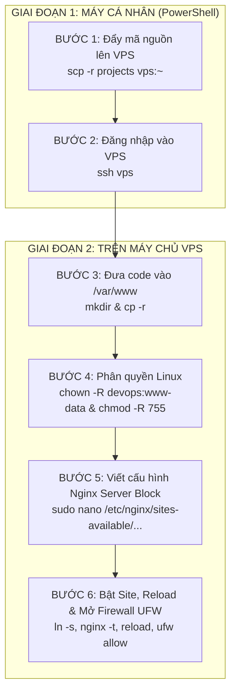

# CẨM NANG TOÀN DIỆN THI DEVOPS: QUY TRÌNH DEPLOY TỪ ĐẦU ĐẾN CUỐI & QUẢN LÝ BẬT/TẮT SITE (CÁCH A)

> **Mục tiêu:** Hướng dẫn sinh viên tự tay thực hiện 100% các bước triển khai dự án web tĩnh lên Nginx VPS từ dòng lệnh, đồng thời nắm vững kỹ thuật bật/tắt (Enable/Disable) nhiều website linh hoạt mà không làm mất mã nguồn.

---

## I. TỔNG QUAN KIẾN TRÚC NGINX (HIỂU ĐỂ KHÔNG BAO GIỜ QUÊN)

Hệ điều hành Ubuntu quản lý Nginx bằng mô hình **"Kho bản vẽ"** và **"Công tắc nguồn"**:
- **`/etc/nginx/sites-available/` (Kho lưu trữ):** Nơi chứa các file cấu hình website. Nginx **không đọc trực tiếp** thư mục này để chạy web. Mọi cấu hình lưu ở đây sẽ luôn an toàn, không bị mất.
- **`/etc/nginx/sites-enabled/` (Công tắc bật):** Nơi chứa **liên kết mềm (Symbolic Link)** trỏ về file cấu hình trong `sites-available`. Chỉ những file có mặt ở đây mới được Nginx kích hoạt chạy thực tế.
- 👉 **Nguyên lý Cách A:** 
  - **Bật site:** Tạo symlink từ `sites-available` sang `sites-enabled`.
  - **Tắt site (để làm bài khác):** Chỉ cần xóa symlink trong `sites-enabled`! File gốc và mã nguồn vẫn còn nguyên vẹn 100%.

---

## II. TOÀN BỘ QUY TRÌNH DEPLOY TỪ ĐẦU ĐẾN CUỐI (6 BƯỚC CHUẨN)



---

### BƯỚC 1: Đẩy mã nguồn lên VPS (Tại PowerShell máy cá nhân)
Đứng tại thư mục chứa source code (`d:\IT209\homework\practice_ss07\ex1`):
```powershell
scp -r projects vps:~
```
*(Nếu chưa cấu hình SSH alias, gõ lệnh đầy đủ: `scp -P 2222 -r projects devops@103.72.57.112:~`)*

---

### BƯỚC 2: Đăng nhập vào VPS
```powershell
ssh vps
```
*(Hoặc: `ssh -p 2222 devops@103.72.57.112`)*

---

### BƯỚC 3: Đưa mã nguồn vào thư mục web chuẩn Linux (Trên VPS)
```bash
# 1. Tạo các thư mục web đích
sudo mkdir -p /var/www/portfolio /var/www/docs /var/www/saas-landing

# 2. Copy code tương ứng vào từng thư mục
sudo cp -r ~/projects/portfolio/* /var/www/portfolio/
sudo cp -r ~/projects/docs/* /var/www/docs/
sudo cp -r ~/projects/saas-landing/* /var/www/saas-landing/
```

---

### BƯỚC 4: Phân quyền Linux (Quyết định - Chống lỗi 403 Forbidden)
```bash
# 1. Gán quyền sở hữu cho user hiện tại và nhóm www-data (nhóm thực thi Nginx)
sudo chown -R $USER:www-data /var/www/portfolio /var/www/docs /var/www/saas-landing

# 2. Cấp quyền đọc/thực thi (755) cho thư mục
sudo chmod -R 755 /var/www/portfolio /var/www/docs /var/www/saas-landing
```

---

### BƯỚC 5: Tự tay viết file cấu hình Nginx Server Block
```bash
sudo nano /etc/nginx/sites-available/multi-sites.conf
```
*Dán nội dung cấu hình 3 cổng (8081, 8082, 8083):*
```nginx
# Site 1: Portfolio (Port 8081)
server {
    listen 8081;
    server_name _;
    root /var/www/portfolio;
    index index.html index.htm;
    location / {
        try_files $uri $uri/ =404;
    }
}

# Site 2: Docs (Port 8082)
server {
    listen 8082;
    server_name _;
    root /var/www/docs;
    index index.html index.htm;
    location / {
        try_files $uri $uri/ =404;
    }
}

# Site 3: SaaS Landing (Port 8083)
server {
    listen 8083;
    server_name _;
    root /var/www/saas-landing;
    index index.html index.htm;
    location / {
        try_files $uri $uri/ =404;
    }
}
```
*(Lưu file: Nhấn `Ctrl + O` -> `Enter`. Thoát: Nhấn `Ctrl + X`)*.

---

### BƯỚC 6: Bật Site, Nạp cấu hình & Mở tường lửa UFW

```bash
# 1. Bật Site (Tạo Symbolic Link sang sites-enabled)
sudo ln -s /etc/nginx/sites-available/multi-sites.conf /etc/nginx/sites-enabled/

# 2. KIỂM TRA CÚ PHÁP (BẮT BUỘC TRƯỚC KHI RELOAD)
sudo nginx -t

# 3. Reload Nginx để áp dụng cấu hình
sudo systemctl reload nginx

# 4. Mở cổng trên tường lửa UFW
sudo ufw allow 8081/tcp
sudo ufw allow 8082/tcp
sudo ufw allow 8083/tcp

# 5. Kiểm tra nghiệm thu bằng curl nội bộ
curl -I http://localhost:8081
curl -I http://localhost:8082
curl -I http://localhost:8083
```
*Mở trình duyệt truy cập: `http://103.72.57.112:8081`, `:8082`, `:8083` để kiểm tra kết quả.*

---

## III. QUẢN LÝ THEO CÁCH A: KỸ THUẬT BẬT / TẮT SITE LINH HOẠT

Khi bạn đã hoàn thành bài thi này và muốn làm một bài tập khác (hoặc làm câu tiếp theo có thể trùng cổng):

### 1. Cách TẮT website (Disable Site) để giải phóng cổng
Chỉ cần xóa **liên kết mềm** trong `sites-enabled` (KHÔNG ĐƯỢC XÓA trong `sites-available` hay `/var/www/`):

```bash
# Xóa symlink công tắc
sudo rm /etc/nginx/sites-enabled/multi-sites.conf

# Reload Nginx để giải phóng cổng 8081, 8082, 8083 ngay lập tức
sudo systemctl reload nginx
```
> **Kết quả:** Các cổng `8081`, `8082`, `8083` được giải phóng hoàn toàn để bạn làm bài thi khác. File cấu hình và mã nguồn gốc vẫn nguyên vẹn 100%!

---

### 2. Cách BẬT LẠI website (Re-enable Site) khi giám thị muốn chấm bài
Khi thầy cô muốn kiểm tra lại bài cũ, bạn chỉ mất đúng 3 giây để bật lại toàn bộ:

```bash
# 1. Tạo lại liên kết mềm
sudo ln -s /etc/nginx/sites-available/multi-sites.conf /etc/nginx/sites-enabled/

# 2. Kiểm tra cú pháp và reload
sudo nginx -t
sudo systemctl reload nginx
```
> **Kết quả:** Toàn bộ 3 website hoạt động trở lại ngay lập tức mà không cần copy code hay viết lại cấu hình từ đầu!

---

## IV. BẢNG TRA CỨU CẤP CỨU LỖI PHÒNG THI (TROUBLESHOOTING)

| Lỗi gặp phải | Nguyên nhân | Lệnh sửa tức thì trong 30s |
| :--- | :--- | :--- |
| **`403 Forbidden`** | Nginx (`www-data`) không có quyền đọc file/thư mục. | `sudo chown -R $USER:www-data /var/www/<site>`<br>`sudo chmod -R 755 /var/www/<site>` |
| **`404 Not Found`** | Sai đường dẫn chỉ thị `root` trong file `.conf`. | Mở lại `sudo nano /etc/nginx/sites-available/...` kiểm tra lại đường dẫn `root`. |
| **Trình duyệt xoay vòng vô tận (Timeout)** | Quên chưa mở cổng trên UFW. | `sudo ufw allow <port>/tcp` rồi `sudo ufw status`. |
| **`nginx -t` báo `conflicting server name` hoặc `already in use`** | Bị trùng cổng với một file khác trong `sites-enabled`. | Kiểm tra các file đang bật: `ls -l /etc/nginx/sites-enabled/` rồi tắt file trùng bằng: `sudo rm /etc/nginx/sites-enabled/<file_trùng>.conf`. |
