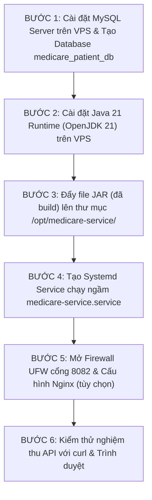

# HƯỚNG DẪN DEPLOY DỰ ÁN SPRING BOOT 3 (JAVA 21) & MYSQL (MEDICARE MEDICAL SERVICE)

> **Mục tiêu:** Hướng dẫn từng bước từ dòng lệnh để triển khai hoàn chỉnh dự án Microservice `medicare-medical-service` (Java 21, Gradle, JPA Hibernate) kết nối MySQL trên máy chủ VPS Ubuntu.

---

## 1. PHÂN TÍCH MÃ NGUỒN DỰ ÁN
- **Tên dự án:** `medicare-medical-service` (com.ptit)
- **Công nghệ cốt lõi:** Java 21, Spring Boot 3 / Cloud, Gradle, Spring Data JPA, Hibernate, MySQL Connector/J, Lombok.
- **Cổng dịch vụ:** **`8082`**
- **Cơ sở dữ liệu:** MySQL database `medicare_patient_db`, user `root` (hoặc `devops_user`), password `002203Huylam!`.
- **Dữ liệu mẫu tự động:** Class `DataInitializer` sẽ tự động khởi tạo **15 hồ sơ bệnh án chuẩn y tế** + **3 hồ sơ xóa mềm** ngay khi kết nối database thành công.
- **REST Endpoints chính:**
  - `GET /api/v1/medicals` : Lấy danh sách 15 hồ sơ bệnh án
  - `GET /api/v1/medicals/deleted` : Lấy danh sách hồ sơ đã xóa mềm
  - `GET /api/v1/medicals/{id}` : Lấy chi tiết bệnh án theo ID
  - `POST /api/v1/medicals` : Tạo bệnh án mới

---

## 2. QUY TRÌNH DEPLOY TỪ ĐẦU ĐẾN CUỐI (STEP-BY-STEP)



---

### BƯỚC 1: CÀI ĐẶT & THIẾT LẬP MYSQL SERVER TRÊN VPS

Đăng nhập vào VPS (`ssh vps`):

#### 1.1. Cài đặt MySQL Server:
```bash
sudo apt update
sudo apt install -y mysql-server
sudo systemctl enable --now mysql
```

#### 1.2. Tạo Database và Tài khoản đúng theo cấu hình:
Vào console MySQL bằng quyền root:
```bash
sudo mysql
```

Chạy lần lượt các lệnh SQL sau:
```sql
-- 1. Tạo Database cho ứng dụng
CREATE DATABASE IF NOT EXISTS medicare_patient_db CHARACTER SET utf8mb4 COLLATE utf8mb4_unicode_ci;

-- 2. Cấu hình xác thực mật khẩu cho user root theo đúng application.yaml
ALTER USER 'root'@'localhost' IDENTIFIED WITH mysql_native_password BY '002203Huylam!';

-- 3. Tạo thêm user devops dự phòng (Best practice)
CREATE USER IF NOT EXISTS 'devops'@'localhost' IDENTIFIED BY '002203Huylam!';
GRANT ALL PRIVILEGES ON medicare_patient_db.* TO 'devops'@'localhost';

-- 4. Áp dụng quyền và thoát
FLUSH PRIVILEGES;
EXIT;
```

#### 1.3. Kiểm tra kết nối MySQL:
```bash
mysql -u root -p'002203Huylam!' -e "SHOW DATABASES;"
```
*(Thấy hiển thị `medicare_patient_db` là kết nối MySQL thành công 100%)*.

---

### BƯỚC 2: CÀI ĐẶT MÔI TRƯỜNG JAVA 21 TRÊN VPS

Dự án yêu cầu Java 21 (`JavaLanguageVersion.of(21)`), do đó trên VPS bạn phải cài OpenJDK 21:

```bash
sudo apt install -y openjdk-21-jre-headless

# Kiểm tra phiên bản Java trên VPS:
java -version
```
*(Kết quả phải hiển thị `openjdk version "21.x.x"`)*.

---

### BƯỚC 3: ĐẨY FILE JAR LÊN VPS

File `medicare-medical-service-0.0.1-SNAPSHOT.jar` đã được build sẵn tại máy cá nhân (`build/libs/`).

#### 3.1. Trên VPS: Tạo thư mục chứa ứng dụng:
```bash
sudo mkdir -p /opt/medicare-service
sudo chown -R devops:devops /opt/medicare-service
```

#### 3.2. Tại PowerShell máy cá nhân (Thư mục `practice_ss07\ex2`):
Chạy lệnh SCP đẩy trực tiếp file JAR lên VPS:
```powershell
scp build/libs/medicare-medical-service-0.0.1-SNAPSHOT.jar vps:/opt/medicare-service/app.jar
```
*(Lệnh này đổi tên file ngắn gọn thành `app.jar` trên VPS để dễ quản trị)*.

---

### BƯỚC 4: TẠO SYSTEMD SERVICE QUẢN LÝ TIẾN TRÌNH CHẠY NGẦM

Tạo file service để ứng dụng chạy nền, tự restart khi lỗi, giới hạn RAM để không làm treo VPS:

```bash
sudo nano /etc/systemd/system/medicare-service.service
```

Dán nội dung cấu hình sau vào:
```ini
[Unit]
Description=Medicare Medical Service Spring Boot Application
After=network.target mysql.service

[Service]
User=devops
WorkingDirectory=/opt/medicare-service
ExecStart=/usr/bin/java -Xms128m -Xmx384m -jar /opt/medicare-service/app.jar
SuccessExitStatus=143
Restart=always
RestartSec=10
StandardOutput=journal
StandardError=journal
SyslogIdentifier=medicare-service

[Install]
WantedBy=multi-user.target
```
*(Nhấn `Ctrl + O` -> `Enter` để lưu, `Ctrl + X` để thoát)*.

#### Khởi động Service:
```bash
sudo systemctl daemon-reload
sudo systemctl enable --now medicare-service
sudo systemctl status medicare-service --no-pager
```

> **Xem log Spring Boot nạp dữ liệu:**
> ```bash
> sudo journalctl -u medicare-service -f
> ```
> *(Khi thấy dòng: `Tomcat started on port 8082 (http)` là ứng dụng đã khởi động thành công và nạp sẵn 15 bệnh án vào MySQL! Nhấn `Ctrl + C` để thoát log)*.

---

### BƯỚC 5: MỞ TƯỜNG LỬA UFW & CẤU HÌNH NGINX

#### 5.1. Mở cổng 8082 trên tường lửa UFW:
```bash
sudo ufw allow 8082/tcp
sudo ufw status verbose
```

#### 5.2. (Tùy chọn) Cấu hình Nginx Reverse Proxy (Nếu muốn trỏ từ cổng 80 vào 8082):
```bash
sudo nano /etc/nginx/sites-available/medicare-service.conf
```
*Nội dung:*
```nginx
server {
    listen 80;
    server_name _;

    location / {
        proxy_pass http://127.0.0.1:8082;
        proxy_set_header Host $host;
        proxy_set_header X-Real-IP $remote_addr;
        proxy_set_header X-Forwarded-For $proxy_add_x_forwarded_for;
        proxy_set_header X-Forwarded-Proto $scheme;
    }
}
```
*Kích hoạt:*
```bash
sudo ln -s /etc/nginx/sites-available/medicare-service.conf /etc/nginx/sites-enabled/
sudo nginx -t
sudo systemctl reload nginx
sudo ufw allow 80/tcp
```

---

### BƯỚC 6: KIỂM THỬ VÀ NGHIỆM THU HỆ THỐNG

#### 6.1. Kiểm tra danh sách bệnh án bằng curl trên VPS:
```bash
curl -s http://localhost:8082/api/v1/medicals | grep -o "MED2026[0-9]*"
```
*(Sẽ in ra danh sách các mã bệnh án: `MED202609010001`, `MED202609010002`, ...)*

#### 6.2. Kiểm tra dữ liệu thực tế trong MySQL:
```bash
mysql -u root -p'002203Huylam!' medicare_patient_db -e "SELECT id, record_code, diagnosis, status FROM medicals LIMIT 5;"
```

#### 6.3. Kiểm tra trên trình duyệt máy tính cá nhân:
Mở trình duyệt truy cập:
- `http://103.72.57.112:8082/api/v1/medicals`
- Hoặc: `http://103.72.57.112:8082/api/v1/medicals/deleted`

---

## 3. KỸ THUẬT QUẢN LÝ CÁCH A (BẬT / TẮT KHI THI)

- **Khi muốn TẮT dịch vụ:**
  ```bash
  sudo systemctl stop medicare-service
  sudo systemctl disable medicare-service
  ```
- **Khi muốn BẬT LẠI dịch vụ để giám thị chấm điểm:**
  ```bash
  sudo systemctl enable --now medicare-service
  ```
