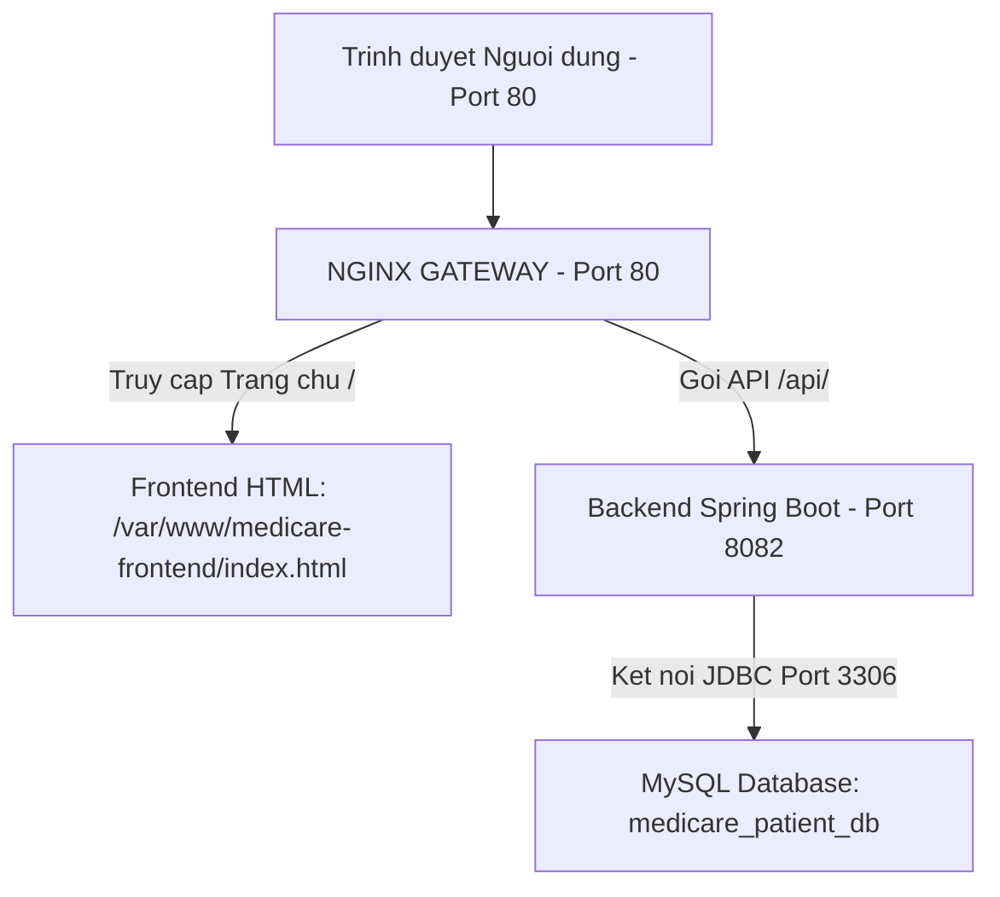

# BÀI THI THỰC HÀNH DEVOPS (BÀI 3): DEPLOY HỆ THỐNG FULLSTACK HOÀN CHỈNH
## FRONTEND HTML + BACKEND SPRING BOOT + MYSQL DATABASE

> **Bối cảnh phòng thi:** Đề bài cung cấp cả mã nguồn Frontend (file HTML giao diện) và Backend (Dự án Spring Boot kết nối MySQL). Sinh viên phải tự tay cấu hình Nginx làm Gateway tích hợp, phục vụ giao diện tĩnh và chuyển tiếp API vào backend, đồng thời kết nối cơ sở dữ liệu.

---

## 1. MÔ HÌNH KIẾN TRÚC FULLSTACK (ALL-IN-ONE GATEWAY)



- **Cổng 80 duy nhất:** Người dùng và giám khảo chỉ cần mở đúng 1 link: `http://103.72.57.112/`.
- **Không bao giờ bị lỗi CORS:** Vì cả giao diện và API đều chạy chung trên cổng 80 của Nginx.
- **Tính năng giao diện:** Xem danh sách 15 bệnh án, xem thùng rác xóa mềm, thêm bệnh án mới, xem chi tiết và xóa mềm theo thời gian thực.

---

## 2. QUY TRÌNH TRIỂN KHAI 5 GIAI ĐOẠN TỪ ĐẦU ĐẾN CUỐI

---

### GIAI ĐOẠN 1: CƠ SỞ DỮ LIỆU MYSQL (DATABASE TIER)
*(Nếu máy chủ VPS đã làm ở Bài 2 rồi thì database `medicare_patient_db` đã có sẵn. Nếu chưa, chạy các lệnh sau trên VPS)*:

```bash
sudo apt update && sudo apt install -y mysql-server
sudo mysql
```
Trong giao diện `mysql>`:
```sql
CREATE DATABASE IF NOT EXISTS medicare_patient_db CHARACTER SET utf8mb4 COLLATE utf8mb4_unicode_ci;
ALTER USER 'root'@'localhost' IDENTIFIED WITH mysql_native_password BY '002203Huylam!';
GRANT ALL PRIVILEGES ON medicare_patient_db.* TO 'root'@'localhost';
FLUSH PRIVILEGES;
EXIT;
```

---

### GIAI ĐOẠN 2: TRIỂN KHAI BACKEND SPRING BOOT CHẠY NGẦM (APP TIER)

#### 2.1. Tại PowerShell máy cá nhân (Thư mục `practice_ss07\ex3`):
Đẩy file `.jar` đã build sẵn lên VPS:
```powershell
scp build/libs/medicare-medical-service-0.0.1-SNAPSHOT.jar vps:~/app.jar
```

#### 2.2. Trên VPS: Đưa file JAR vào `/opt/` và cấu hình Systemd:
```bash
sudo mkdir -p /opt/medicare-service
sudo mv ~/app.jar /opt/medicare-service/app.jar
sudo chown -R devops:devops /opt/medicare-service

# Tạo file cấu hình dịch vụ chạy ngầm
sudo nano /etc/systemd/system/medicare-service.service
```

*Nội dung cấu hình:*
```ini
[Unit]
Description=Medicare Medical Service Spring Boot Application
After=network.target mysql.service

[Service]
User=devops
WorkingDirectory=/opt/medicare-service
ExecStart=/usr/bin/java -Xms128m -Xmx384m -jar /opt/medicare-service/app.jar
SuccessExitStatus=143
Restart=always
RestartSec=10
StandardOutput=journal
StandardError=journal
SyslogIdentifier=medicare-service

[Install]
WantedBy=multi-user.target
```
*(Lưu: `Ctrl + O` -> `Enter`. Thoát: `Ctrl + X`)*.

Khởi động Service:
```bash
sudo systemctl daemon-reload
sudo systemctl enable --now medicare-service
sudo systemctl status medicare-service --no-pager
```

---

### GIAI ĐOẠN 3: TRIỂN KHAI FRONTEND HTML (WEB TIER)

#### 3.1. Tại PowerShell máy cá nhân (Thư mục `practice_ss07\ex3`):
Đẩy thư mục `frontend` lên VPS:
```powershell
scp -r frontend vps:~
```

#### 3.2. Trên VPS: Chuyển vào `/var/www/` và phân quyền chuẩn Linux:
```bash
# Tạo thư mục web đích
sudo mkdir -p /var/www/medicare-frontend

# Copy code HTML vào
sudo cp -r ~/frontend/* /var/www/medicare-frontend/

# Phân quyền cho www-data (chống lỗi 403 Forbidden)
sudo chown -R $USER:www-data /var/www/medicare-frontend
sudo chmod -R 755 /var/www/medicare-frontend
```

---

### GIAI ĐOẠN 4: CẤU HÌNH NGINX ALL-IN-ONE GATEWAY

Đây là bước kết hợp cả Frontend và Backend lại với nhau qua cổng 80:

```bash
sudo nano /etc/nginx/sites-available/medicare-fullstack.conf
```

Dán nội dung cấu hình sau:
```nginx
server {
    listen 80;
    server_name _;

    # 1. Phục vụ giao diện Frontend HTML
    root /var/www/medicare-frontend;
    index index.html index.htm;

    location / {
        try_files $uri $uri/ /index.html;
    }

    # 2. Chuyển tiếp (Reverse Proxy) mọi request API vào Spring Boot
    location /api/ {
        proxy_pass http://127.0.0.1:8082;
        proxy_set_header Host $host;
        proxy_set_header X-Real-IP $remote_addr;
        proxy_set_header X-Forwarded-For $proxy_add_x_forwarded_for;
        proxy_set_header X-Forwarded-Proto $scheme;

        # Timeouts
        proxy_connect_timeout 60s;
        proxy_send_timeout 60s;
        proxy_read_timeout 60s;
    }
}
```
*(Lưu: `Ctrl + O` -> `Enter`. Thoát: `Ctrl + X`)*.

#### Kích hoạt Nginx và kiểm tra cú pháp:
```bash
# 1. Bật site
sudo ln -s /etc/nginx/sites-available/medicare-fullstack.conf /etc/nginx/sites-enabled/

# 2. Kiểm tra cú pháp (Bắt buộc phải thấy "syntax is ok")
sudo nginx -t

# 3. Reload Nginx
sudo systemctl reload nginx
```

---

### GIAI ĐOẠN 5: MỞ FIREWALL UFW VÀ NGHIỆM THU TOÀN DIỆN

```bash
# Mở cổng 80 duy nhất trên tường lửa UFW
sudo ufw allow 80/tcp
sudo ufw status
```

#### Nghiệm thu trên trình duyệt:
Mở trình duyệt trên máy tính hoặc điện thoại cá nhân truy cập:  
👉 **`http://103.72.57.112/`**

**Các tính năng cần kiểm tra:**
1. Trạng thái hệ thống: Badge màu xanh **"Nginx & Spring Boot: ONLINE"**.
2. Bảng thống kê: Hiển thị 15 hồ sơ bệnh án đang hoạt động.
3. Thử bấm nút **"➕ Thêm bệnh án mới"** -> Điền thông tin và lưu -> Dữ liệu lưu vào MySQL và xuất hiện ngay trên bảng.
4. Thử bấm nút **"Xóa mềm"** -> Hồ sơ chuyển sang tab **"Thùng rác"**.
5. Bấm **"Khôi phục"** -> Hồ sơ quay lại danh sách hoạt động.

---

## 3. KỸ THUẬT QUẢN LÝ CÁCH A (BẬT / TẮT KHI THI XONG)

- **Khi muốn tắt để làm bài thi khác:**
  ```bash
  sudo systemctl stop medicare-service
  sudo rm -f /etc/nginx/sites-enabled/medicare-fullstack.conf
  sudo systemctl reload nginx
  ```
- **Khi giám thị muốn xem lại bài này để chấm:**
  ```bash
  sudo ln -s /etc/nginx/sites-available/medicare-fullstack.conf /etc/nginx/sites-enabled/
  sudo systemctl reload nginx
  sudo systemctl start medicare-service
  ```
