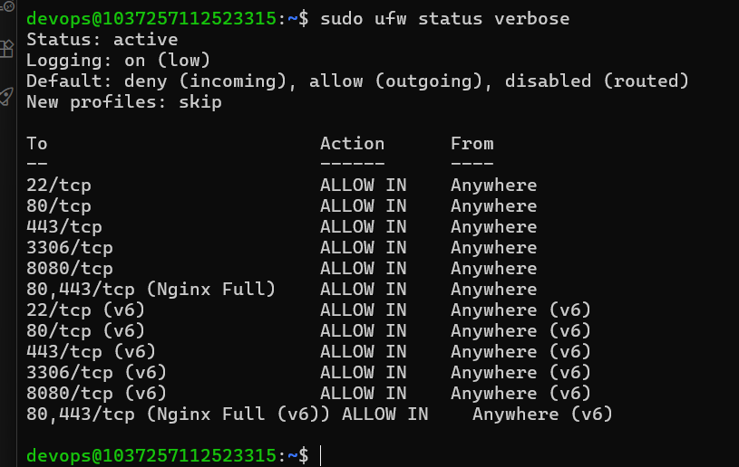

# Bài 4: Cấu Hình Tường Lửa Bảo Vệ Máy Chủ (UFW & Cloud Firewall Integration)

---

## 1. Mục Tiêu Bài Thực Hành
- Áp dụng nguyên lý kiến trúc an ninh thông tin **Phòng thủ theo chiều sâu (Defense-in-Depth)** để bảo vệ máy chủ đám mây.
- Triển khai mô hình tường lửa 2 lớp độc lập:
  - **Lớp 1 (Network-level):** Cloud Firewall ở tầng hạ tầng biên mạng, lọc sạch các gói tin nguy hại trước khi chạm tới card mạng (NIC) của máy chủ, giảm thiểu tải xử lý CPU và nguy cơ tấn công DDoS.
  - **Lớp 2 (Host-level):** Tường lửa UFW (Uncomplicated Firewall) tích hợp sẵn trong kernel Linux (thông qua iptables/nftables) lọc trực tiếp tại hệ điều hành Ubuntu.
- Thiết lập chính sách bảo mật nghiêm ngặt:
  - Chặn toàn bộ lưu lượng đi vào không xác định (**Default Deny Incoming**).
  - Cho phép lưu lượng từ máy chủ truy xuất ra ngoài (**Default Allow Outgoing**).
  - Chỉ mở chính xác 2 cổng dịch vụ cần thiết: Cổng `22/tcp` (SSH) và Cổng `80/tcp` (HTTP Web).

---

## 2. Bảng Lệnh & Giải Thích Chi Tiết (SOP)

| STT | Câu lệnh thực thi | Mục đích / Giải thích kỹ thuật |
| :---: | :--- | :--- |
| **1** | `sudo ufw default deny incoming` | Thiết lập chính sách mặc định: Từ chối toàn bộ gói tin đi vào máy chủ nếu không có luật cho phép cụ thể. |
| **2** | `sudo ufw default allow outgoing` | Thiết lập chính sách mặc định: Cho phép máy chủ gửi gói tin ra ngoài (cập nhật apt, tải package). |
| **3** | `sudo ufw allow 22/tcp` | Mở cổng TCP 22 phục vụ kết nối quản trị từ xa SSH. *(Rất quan trọng: Phải mở trước khi kích hoạt UFW để tránh bị khóa ngoài - lockout)*. |
| **4** | `sudo ufw allow 80/tcp` | Mở cổng TCP 80 phục vụ lưu lượng truy cập Web HTTP của Nginx. |
| **5** | `sudo ufw enable` | Kích hoạt tường lửa UFW và đặt chế độ tự khởi động cùng hệ điều hành. |
| **6** | `sudo ufw status verbose` | Kiểm tra chi tiết trạng thái hoạt động, chính sách mặc định và danh sách các cổng đang được mở. |

---

## 3. Các Bước Triển Khai Thực Tế

### Lớp 1: Cấu hình tường lửa UFW trên hệ điều hành Ubuntu (Host-based)

Đăng nhập vào máy chủ bằng tài khoản quản trị `devops`:
```powershell
ssh -i $HOME\.ssh\id_ed25519 devops@103.72.57.112
```

Thực thi tuần tự các quy tắc bảo vệ:
```bash
# 1. Đặt chính sách mặc định
sudo ufw default deny incoming
sudo ufw default allow outgoing

# 2. Mở cổng SSH và HTTP
sudo ufw allow 22/tcp
sudo ufw allow 80/tcp

# 3. Kích hoạt UFW (Nhấn 'y' khi hệ thống cảnh báo về kết nối SSH)
sudo ufw enable

# 4. Kiểm tra trạng thái tường lửa
sudo ufw status verbose
```

---

### Lớp 2: Cấu hình Cloud Firewall ở tầng hạ tầng (Network-based)

Trên giao diện điều khiển đám mây (Cloud Console / Dashboard):
1. Truy cập mục **Firewalls / Security Groups** ➔ Chọn **Create Firewall**.
2. Đặt tên tường lửa: `firewall-web-server`.
3. Cấu hình **Inbound Rules** (Quy tắc lưu lượng vào):
   - **SSH:** Protocol `TCP`, Port `22`, Source: `All IPv4`, `All IPv6`.
   - **HTTP:** Protocol `TCP`, Port `80`, Source: `All IPv4`, `All IPv6`.
4. Cấu hình **Outbound Rules** (Quy tắc lưu lượng ra):
   - Cho phép tất cả giao thức đến mọi đích đến (`All IPv4`, `All IPv6`).
5. Gán Droplet / VPS vào danh sách máy chủ được bảo vệ và bấm **Save / Apply**.

---

## 4. Kết Quả Kiểm Tra & Minh Chứng

### 4.1. Đầu ra text của lệnh `sudo ufw status verbose`

```text
devops@1037257112523315:~$ sudo ufw status verbose
Status: active
Logging: on (low)
Default: deny (incoming), allow (outgoing), disabled (routed)
New profiles: skip

To                         Action      From
--                         ------      ----
22/tcp                     ALLOW IN    Anywhere
80/tcp                     ALLOW IN    Anywhere
443/tcp                    ALLOW IN    Anywhere
3306/tcp                   ALLOW IN    Anywhere
8080/tcp                   ALLOW IN    Anywhere
80,443/tcp (Nginx Full)    ALLOW IN    Anywhere
22/tcp (v6)                ALLOW IN    Anywhere (v6)
80/tcp (v6)                ALLOW IN    Anywhere (v6)
443/tcp (v6)               ALLOW IN    Anywhere (v6)
3306/tcp (v6)              ALLOW IN    Anywhere (v6)
8080/tcp (v6)              ALLOW IN    Anywhere (v6)
80,443/tcp (Nginx Full (v6)) ALLOW IN    Anywhere (v6)

devops@1037257112523315:~$             
```

---

### 4.2. Kiểm tra tính toàn vẹn kết nối dịch vụ
- **Kết nối SSH (Port 22):** Tiếp tục kết nối ổn định, không bị đứt phiên làm việc.
- **Truy cập Web (Port 80):** Trình duyệt truy cập `http://103.72.57.112` hiển thị bình thường trang giới thiệu PTIT DevOps.
- **Kiểm tra chặn cổng không hợp lệ:**
  - Thử kiểm tra cổng chưa mở (ví dụ cổng MySQL `3306` hoặc cổng test `8080`) từ máy cá nhân bằng PowerShell:
    ```powershell
    Test-NetConnection -ComputerName 103.72.57.112 -Port 8080
    ```
  - Kết quả trả về: `TcpTestSucceeded : False` (Gói tin bị tường lửa âm thầm loại bỏ / Drop mà không phản hồi).

---

### 4.3. Ảnh chụp màn hình cấu hình Cloud Firewall

*(Đính kèm ảnh chụp màn hình cấu hình Cloud Firewall / Network Security Group trên giao diện quản trị)*



---

## 5. Đánh Giá & Bài Học Rút Ra
1. **Nguyên lý Phòng thủ 2 lớp (Defense in Depth):**
   - Cloud Firewall đóng vai trò là "Cổng bảo vệ vòng ngoài": Chặn các cuộc tấn công quét cổng đại trà trước khi gói tin chạm đến CPU máy chủ.
   - UFW đóng vai trò là "Cửa chống trộm vòng trong": Bảo vệ máy chủ trong trường hợp hạ tầng mạng xảy ra sự cố cấu hình nhầm hoặc khi các gói tin nội bộ trong cùng mạng LAN tìm cách xâm nhập.
2. **Quy tắc vàng khi cấu hình Firewall từ xa:**
   - Luôn luôn phải chạy `ufw allow 22/tcp` **TRƯỚC KHI** chạy lệnh `ufw enable`. Nếu kích hoạt khi chưa mở cổng SSH, bạn sẽ bị mất quyền truy cập vào máy chủ vĩnh viễn (Lockout) và phải can thiệp qua VNC/Web Console khẩn cấp của nhà cung cấp.
3. **Chính sách Default Deny:** Đây là tiêu chuẩn bắt buộc của các hệ thống an ninh mạng quốc tế (Zero Trust / Least Privilege). Chỉ mở những gì cần dùng, tất cả những gì không nằm trong danh sách trắng (Whitelist) đều bị chặn mặc định.
