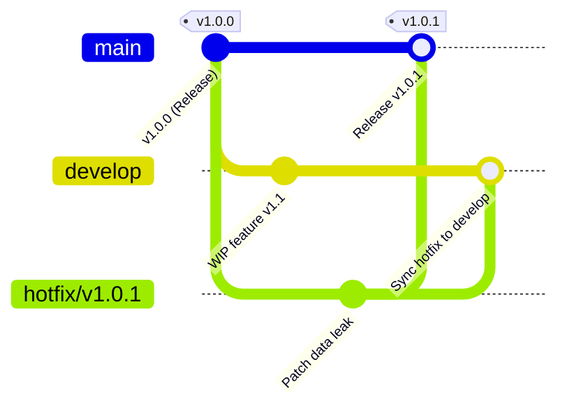

# Bài 4: Mô Phỏng Quy Trình Hotfix & Gitflow Thực Tế

---

## 1. Mục Tiêu Bài Thực Hành
- **Làm chủ mô hình phân nhánh Gitflow chuẩn công nghiệp:**
  - `main`: Nhánh đại diện cho môi trường Production (chỉ chứa các bản phát hành ổn định gắn tag).
  - `develop`: Nhánh tích hợp liên tục cho các tính năng mới đang phát triển dở dang.
  - `hotfix/*`: Nhánh cứu hộ khẩn cấp tách trực tiếp từ `main` để vá lỗi Production mà không làm gián đoạn tiến độ của `develop`.
- **Thực hành quy trình Hotfix khẩn cấp (Emergency Hotfix Workflow):**
  - Tách nhánh `hotfix/v1.0.1` từ `main`.
  - Vá lỗi bảo mật rò rỉ dữ liệu người dùng.
  - Tích hợp ngược lại vào `main` và đánh dấu phiên bản phát hành `v1.0.1`.
- **Quy tắc vàng chống trôi lỗi (Anti-Regression Rule):**
  - Bắt buộc gộp ngược bản vá từ `hotfix/v1.0.1` vào `develop`. Nếu quên bước này, khi `develop` release phiên bản tiếp theo trong tương lai, lỗi rò rỉ dữ liệu cũ sẽ bị tái phát (Regression Bug)!

---

## 2. Sơ Đồ Quy Trình Gitflow Hotfix

### 2.1. Sơ đồ dạng Mermaid:


### 2.2. Sơ đồ biểu diễn dạng ASCII:
```text
(main)    v1.0.0 --------------------------> [Merge Hotfix] (tag: v1.0.1)
             \                                    ^        \
              \                                  /          \
  (hotfix)     \---> [Fix: Data leak] ----------/            \
                \                                             \
  (develop)      \--> [WIP Feature] ------------------------> [Sync Patch]
```

---

## 3. Bảng Lệnh & Giải Thích Chi Tiết (SOP)

| STT | Câu lệnh thực thi | Mục đích / Giải thích kỹ thuật |
| :---: | :--- | :--- |
| **1** | `git tag -a v1.0.0 -m "Release v1.0.0"` | Đánh dấu phiên bản phát hành ổn định đầu tiên trên nhánh `main`. |
| **2** | `git checkout -b develop` | Tạo và chuyển sang nhánh phát triển tính năng tương lai. |
| **3** | `git checkout main && git checkout -b hotfix/v1.0.1` | Tách nhánh sửa lỗi khẩn cấp trực tiếp từ phiên bản Production (`main`). |
| **4** | `git merge --no-ff hotfix/v1.0.1` | Gộp nhánh có tạo commit hợp nhất rõ ràng (Non Fast-Forward) để lưu vết lịch sử. |
| **5** | `git tag -a v1.0.1 -m "Release Hotfix 1.0.1"` | Đánh dấu phiên bản vá lỗi khẩn cấp `v1.0.1` trên `main`. |
| **6** | `git branch -d hotfix/v1.0.1` | Xóa nhánh hotfix cục bộ sau khi đã hoàn thành việc gộp vào cả 2 nhánh. |
| **7** | `git log --graph --oneline --all` | Xuất sơ đồ lịch sử toàn cục hiển thị tất cả các nhánh và thẻ tag. |

---

## 4. Các Bước Triển Khai Thực Tế

### Bước 1: Khởi tạo repository và phiên bản Production `v1.0.0` trên `main`
Mở PowerShell tại thư mục `session_05\ex4`:
```powershell
cd d:\IT209\homework\session_05\ex4
git init
git branch -M main

# Tạo code phiên bản 1.0.0
Set-Content -Path "app.py" -Value 'print("Version 1.0.0: Production Live")'
git add app.py
git commit -m "release: v1.0.0 production live"
git tag -a v1.0.0 -m "Release version 1.0.0"
```

---

### Bước 2: Tạo nhánh `develop` phát triển tính năng tương lai
```powershell
git checkout -b develop

# Đang phát triển tính năng cho bản v1.1.0 (chưa xong, không thể release)
Add-Content -Path "app.py" -Value 'print("Feature in development for v1.1.0")'
git add app.py
git commit -m "feat: wip new features for next release"
```

---

### Bước 3: Phát hiện lỗi nghiêm trọng trên Production - Tách nhánh `hotfix/v1.0.1`
> ⚠️ **Quy tắc Gitflow:** Nhánh Hotfix **phải tách trực tiếp từ `main`**, không được tách từ `develop`!

```powershell
git checkout main
git checkout -b hotfix/v1.0.1
```

Sửa lỗi bảo mật rò rỉ dữ liệu trong file `app.py`:
```powershell
Set-Content -Path "app.py" -Value 'print("Version 1.0.1: Security patch applied - Data leak fixed")'
git add app.py
git commit -m "fix(security): patch critical user data leak"
```

---

### Bước 4: Gộp Hotfix vào `main` và Đánh thẻ phiên bản `v1.0.1`
```powershell
# Chuyển về nhánh main
git checkout main

# Gộp hotfix với cờ --no-ff để lưu vết merge commit
git merge --no-ff hotfix/v1.0.1 -m "merge: merge hotfix/v1.0.1 into main"

# Gắn tag phiên bản mới
git tag -a v1.0.1 -m "Release Hotfix 1.0.1"
```

---

### Bước 5: Gộp Hotfix ngược lại vào `develop` (Chống trôi lỗi)
```powershell
# Chuyển về nhánh develop
git checkout develop

# Gộp hotfix vào develop
git merge --no-ff hotfix/v1.0.1 -m "merge: sync hotfix/v1.0.1 into develop"
```

*(Nếu xuất hiện xung đột do code WIP của v1.1.0, dung hòa bằng cách giữ cả 2 dòng: bản vá bảo mật và tính năng WIP, sau đó `git add app.py` và `git commit`)*.

---

### Bước 6: Dọn dẹp nhánh Hotfix
Sau khi đã tích hợp vào cả 2 nhánh thành công, xóa nhánh hotfix tạm thời:
```powershell
git branch -d hotfix/v1.0.1
```

---

### Bước 7: Kiểm tra kết quả toàn cục (Nghiệm thu đề bài)
1. **Kiểm tra danh sách nhánh:**
   ```powershell
   git branch
   ```
   👉 Hiển thị 2 nhánh: `* develop` và `main`.

2. **Kiểm tra danh sách tag:**
   ```powershell
   git tag
   ```
   👉 Hiển thị đầy đủ: `v1.0.0` và `v1.0.1`.

3. **Kiểm tra đồ thị lịch sử gộp nhánh:**
   ```powershell
   git log --graph --oneline --all
   ```

---

## 5. Kết Quả Kiểm Tra & Minh Chứng

### 5.1. Đầu ra text của lệnh `git branch` và `git tag`:

```text
PS D:\IT209\homework\session_05\ex4> git branch
* develop
  main

PS D:\IT209\homework\session_05\ex4> git tag
v1.0.0
v1.0.1
```

---

### 5.2. Đồ thị commit Gitflow hoàn chỉnh (`git log --graph --oneline --all`):

```text
PS D:\IT209\homework\session_05\ex4> git log --graph --oneline --all
>>
*   f5daa91 (HEAD -> develop) merge: sync hotfix/v1.0.1 into develop
|\
PS D:\IT209\homework\session_05\ex4> git log --graph --oneline --all
>>
*   f5daa91 (HEAD -> develop) merge: sync hotfix/v1.0.1 into develop
|\
* | 47cb04c feat: wip new features for next release
|\
* | 47cb04c feat: wip new features for next release
* | 47cb04c feat: wip new features for next release
| | * 6a1b7e5 (tag: v1.0.1, main) merge: merge hotfix/v1.0.1 into main
| |/|
|/|/
| * 951fa1c fix(security): patch critical user data leak
|/
* f3a391f (tag: v1.0.0) release: v1.0.0 production live
```
*(Sơ đồ chứng minh rõ ràng: Commit hotfix `fix(security)` vừa được gộp vào `main` có gắn tag `v1.0.1`, vừa được gộp sang `develop` để tránh trôi lỗi).*

---

## 6. Đánh Giá & Bài Học Rút Ra
1. **Tại sao không sửa lỗi trực tiếp trên nhánh `develop` rồi deploy?**
   - Nhánh `develop` đang chứa các tính năng dở dang của phiên bản tương lai chưa được kiểm thử toàn diện (QA/QC). Nếu deploy cả nhánh `develop` lên Production, hệ thống sẽ gặp thảm họa lỗi tính năng mới.
2. **Quy tắc bắt buộc gộp ngược về `develop`:**
   - Nếu hotfix chỉ được merge vào `main` mà quên merge vào `develop`, khi nhóm phát triển hoàn thiện bản `v1.1.0` từ `develop` và release lên `main`, dòng code sửa lỗi bảo mật sẽ bị ghi đè và lỗi cũ sẽ xuất hiện trở lại (Hiện tượng Regression).
